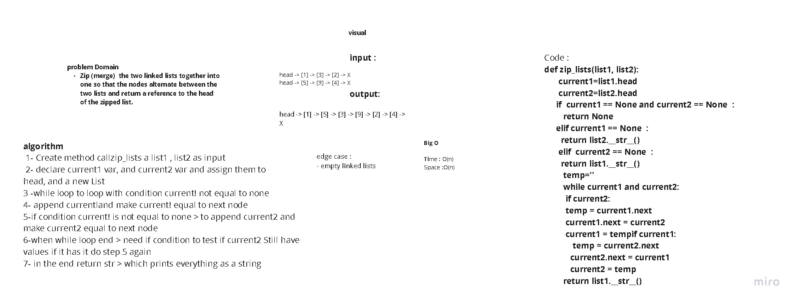

# linked_list_zip

## Problem domain

### Zip the two linked lists together into one so that the nodes alternate between the two lists and return a reference to the head of the zipped list.

## whiteboard 

