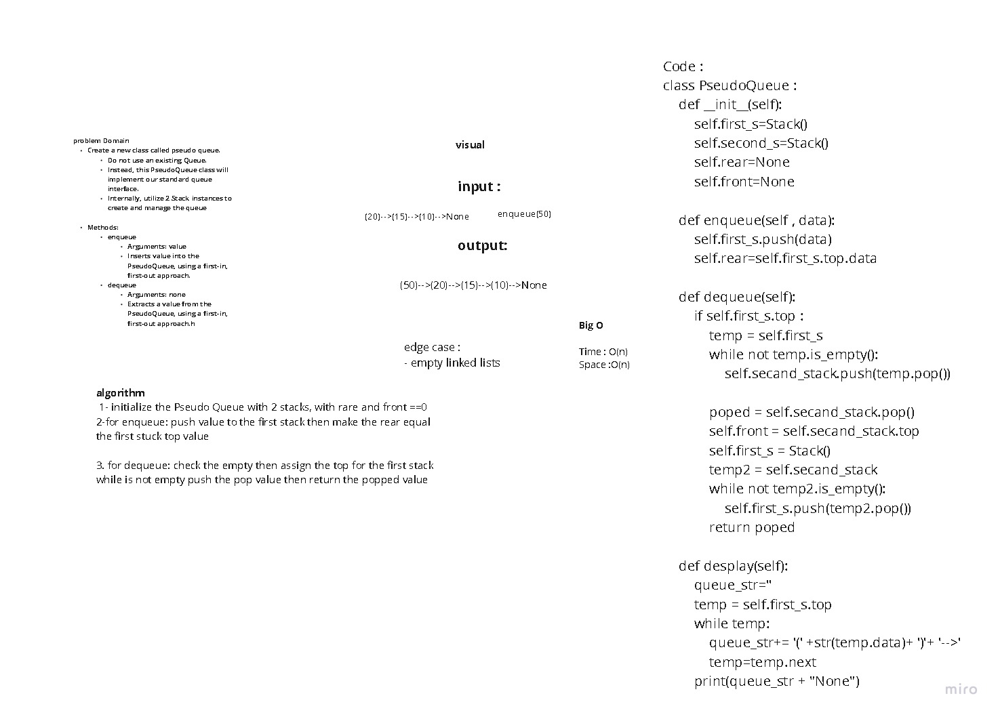

## Challenge Summary 

### Create a new class called pseudo queue by create two instance from stack class and use the stack method to implementation  the , enqueue and dequeue methods

## whiteboard

